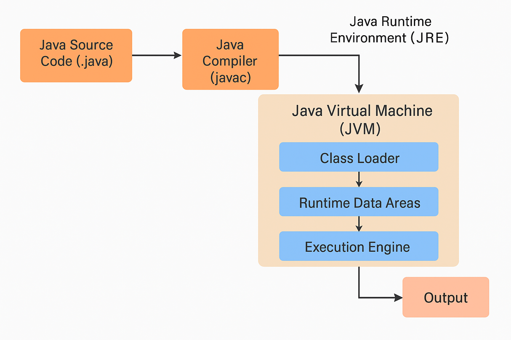
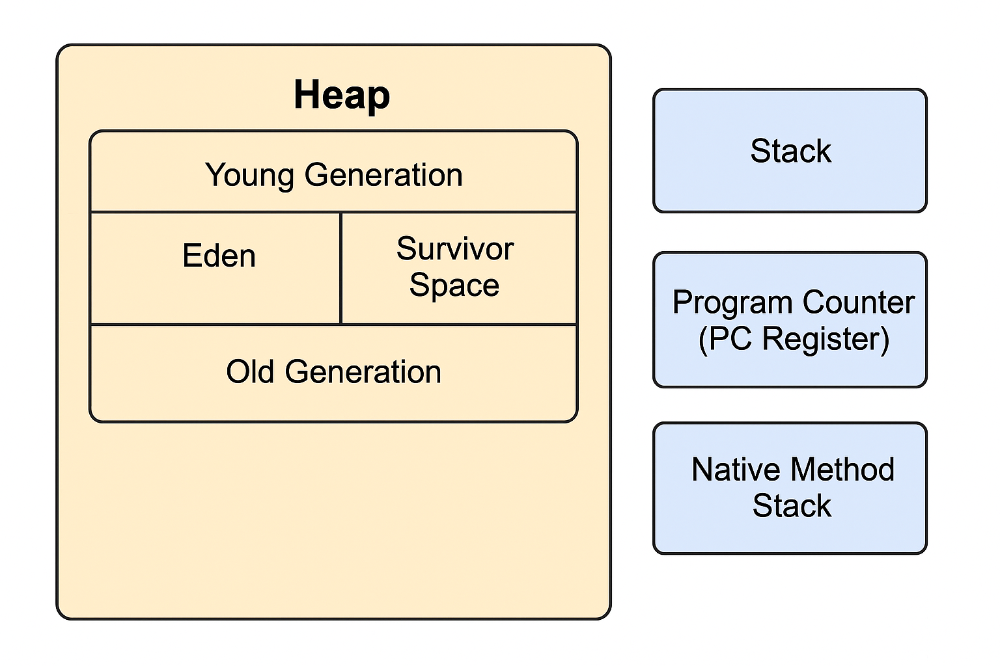
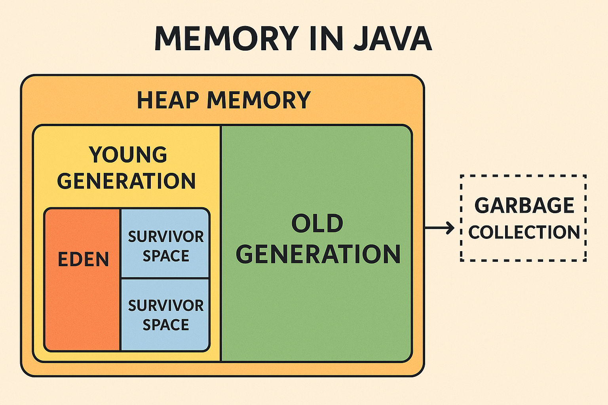

# What is Java?

Java is a high-level, object-oriented, platform-independent programming language developed by Sun Microsystems (now owned by Oracle). It was designed to have the "write once, run anywhere" capability, meaning compiled Java code can run on any device that has a Java Virtual Machine (JVM).


## Java Architecture Overview

Java architecture consists of four main components:

1. Java Source Code (.java files) -
You write your Java programs in .java files using the Java syntax.

2. Java Compiler (javac) - 
The Java compiler converts .java files into bytecode (.class files).
Bytecode is a platform-independent, intermediate representation of your code.

3. Java Virtual Machine (JVM) - 
The JVM runs the bytecode. It interprets or compiles it into machine code for your specific OS.

4. Java Runtime Environment (JRE) - 
JRE provides the JVM + core libraries (like java.lang, java.util, etc.) needed to run Java programs.

## How Java Works (Behind the Scenes)



Here's the step-by-step flow:

1. You write code:

```
public class Hello {
    public static void main(String[] args) {
        System.out.println("Hello, Java!");
    }
}
```

2. Compilation :- You run javac Hello.java → it creates Hello.class (bytecode)

3. Class Loader (JVM Component) :- Loads the .class files into memory.

4. Bytecode Verifier :- Checks bytecode for security and correctness (e.g., no illegal memory access).

5. Interpreter / JIT Compiler:

- Interpreter: Executes bytecode line-by-line (initially).

- JIT (Just-In-Time) Compiler: Converts bytecode into native machine code for faster execution after repeated use.

6. Runtime Execution :- Managed by JVM, with memory managed by Garbage Collector (GC).


## JVM Architecture (Internal Components)

- Class Loader :-  Loads .class files.

- Method Area :- Stores class-level structures (e.g., metadata, static variables).

- Heap :- Stores objects and instance variables.

- Stack :- Stores method calls and local variables (one stack per thread).

- PC Register :- Tracks current instruction of execution.

- Execution Engine :- Interpreter (Line-by-line execution) and JIT Compiler (Converts frequently-used bytecode to machine code)

- Garbage Collector :- Frees up memory by cleaning unused objects.

## How Java Manages Memory

Java manages memory automatically using the Java Virtual Machine (JVM) and a process called Garbage Collection (GC). Here's a breakdown of how memory is handled:

### 1. Memory Areas in JVM

Java divides memory into several key areas:

| Area | Purpose |
|------|---------|
| Heap | Stores objects and class instances (new keyword). |
| Stack |	Stores method calls, local variables, and references. Each thread has its own stack. |
| Method Area (Part of Metaspace) |	Stores class definitions, static variables, and method metadata.|
| Program Counter (PC) Register	| Tracks the address of the current instruction for each thread.|
|Native Method Stack	| Supports native (non-Java) methods written in C/C++. |

### 2. Heap Memory Subdivisions

The Heap is where most memory management occurs and is split into generations:

| Generation	| Description |
|---------------|-------------|
| Young Generation | 	New objects go here. Includes Eden and two Survivor Spaces. |
| Old Generation (Tenured) |	Long-lived objects are moved here from Young Gen. |
| Metaspace |	Stores class metadata (replaced PermGen after Java 8). |


### 3. Lifecycle of an Object in Java

1. Object creation using new → stored in Eden (Young Gen).

2. Minor GC cleans Eden; surviving objects go to Survivor Space.

3. If they survive multiple GCs → moved to Old Gen.

4. Eventually, Major GC (Full GC) cleans Old Gen.

5. Unreachable objects are destroyed by the Garbage Collector.


### 4. Garbage Collection

Garbage collection automatically removes unused objects to free up heap space. Types include:

- Minor GC (Young Gen)

- Major/Full GC (Old Gen + Young Gen)

- G1 GC, ZGC, and others optimize collection time and pauses.


### 5. Memory Management Summary

| Action |	Managed By |
|--------|-------------|
| Object Allocation |	JVM, Heap |
| Stack Frame Management |	JVM, per-thread stack |
| Reclaiming memory |	Garbage Collector |
| Native memory |	JVM + OS |





## How Garbage Collection Works in Java

Garbage Collection (GC) in Java is the process by which the Java Virtual Machine (JVM) automatically reclaims memory by destroying objects that are no longer in use, i.e., no longer referenced by any part of the program.

Hence we have - 

- Less memory leaks

- No dangling pointers

- Cleaner and safer memory usage


### Steps in Java Garbage Collection Process
1. Object Creation :-
When you create an object using new, it’s stored in the Heap Memory.

2. Reference Tracking :- JVM tracks which objects are being referenced by active code (e.g., variables, stacks).

3. Mark Phase :- GC scans the memory and marks all objects that are reachable (i.e., still referenced).

4. Sweep/Delete Phase :- All unmarked objects (unreachable) are considered garbage and are removed from memory.

5. Compact Phase (optional) :- After deletion, GC may rearrange remaining objects to reduce fragmentation.

