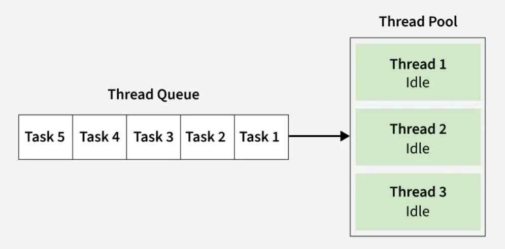
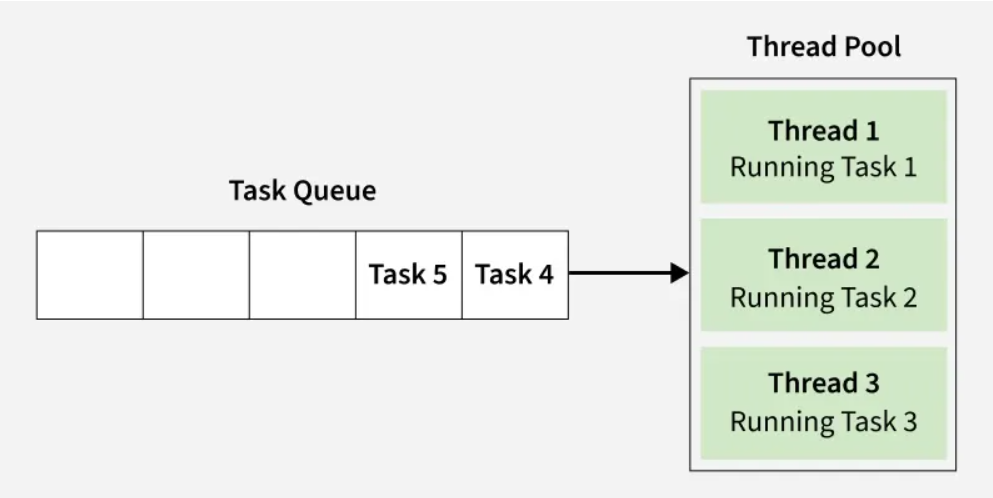
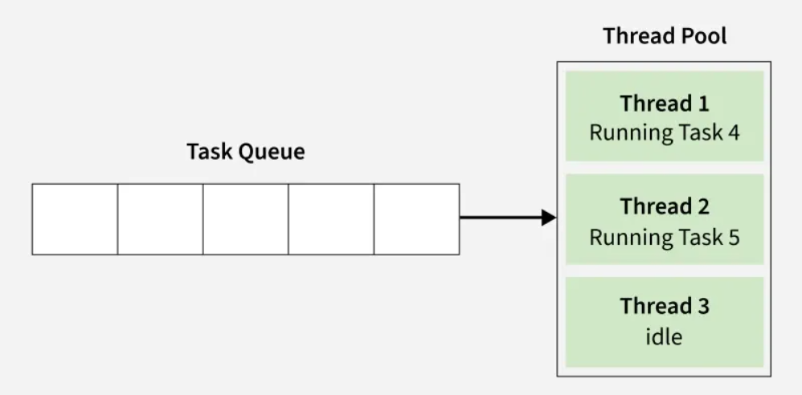

# Thread Pool

- A Thread Pool is a collection of pre-created, reusable threads that are kept ready to perform tasks.

- Instead of creating a new thread every time you need to run something (which is costly in terms of memory and CPU), a thread pool maintains a fixed number of threads.

- When a task is submitted:

    - If a thread is free, it immediately picks up the task and runs it.
    - If all threads are busy, the task waits in a queue until a thread becomes available.
    - After finishing a task, the thread does not die. It goes back to the pool and waits for the next task.


## Benefits of Thread Pool -

**Better Performance:** Threads are reused instead of being created and destroyed repeatedly.

**Faster Response Time:** Tasks don’t need to wait for a new thread to be created.

**Reusability:** Threads remain alive after finishing tasks and are reused for future tasks.

**Resource Management:** Limits the number of concurrent threads, preventing OutOfMemoryError or CPU overload.


## Thread Pool Initialization
When we initialize a thread pool:

- A fixed number of worker threads are created (e.g., 3).

- These threads are kept idle, waiting for tasks.

- A task queue is set up to hold submitted tasks until a worker is free.

## Thread Pool Working

### Step 1: Idle State

- Tasks are submitted and placed in the Task Queue.
- Worker threads exist but are idle until work arrives.




### Step 2: Task Assignment

- Each idle thread picks a task from the queue.
- Example: Thread 1 -> Task 1, Thread 2 -> Task 2, Thread 3 -> Task 3
- Remaining tasks (Task 4, Task 5) wait in the queue.




### Step 3: Thread Reuse

- Once a thread completes its current task, it becomes idle again.
- It immediately takes the next waiting task from the queue.
- Example: Thread 1 -> Task 4, Thread 2 -> Task 5, Thread 3 -> Idle (no tasks left)




### Code Example: Simple Thread Pool

```
import java.util.concurrent.BlockingQueue;
import java.util.concurrent.LinkedBlockingQueue;

// Worker that keeps taking tasks from queue and running them
class Worker extends Thread {
    private BlockingQueue<Runnable> taskQueue;
    private volatile boolean isRunning = true;

    public Worker(BlockingQueue<Runnable> queue, String name) {
        super(name);
        this.taskQueue = queue;
    }

    public void run() {
        try {
            while (isRunning) {
                Runnable task = taskQueue.take();
                if (task == SimpleThreadPool.POISON_PILL) {
                    // Exit loop when poison pill received
                    break;
                }
                task.run();
            }
        } catch (InterruptedException e) {
            Thread.currentThread().interrupt();
        }
    }

    public void shutdown() {
        isRunning = false;
        this.interrupt(); // in case it's blocked on take()
    }
}

// Simple Thread Pool
class SimpleThreadPool {
    private BlockingQueue<Runnable> taskQueue;
    private Worker[] workers;
    static final Runnable POISON_PILL = () -> { };

    public SimpleThreadPool(int poolSize) {
        taskQueue = new LinkedBlockingQueue<>();
        workers = new Worker[poolSize];

        // Create and start workers
        for (int i = 0; i < poolSize; i++) {
            workers[i] = new Worker(taskQueue, "Worker-" + (i + 1));
            workers[i].start();
        }
    }

    // Submit new task to queue
    public void submit(Runnable task) {
        taskQueue.offer(task);
    }

    // Gracefully shutdown
    public void shutdown() {
        // Send one poison pill per worker
        for (int i = 0; i < workers.length; i++) {
            taskQueue.offer(POISON_PILL);
        }
    }
}

// Test Program
public class ThreadPoolDemo {
    public static void main(String[] args) {
        // Initialize thread pool with 3 workers
        SimpleThreadPool pool = new SimpleThreadPool(3);

        // Submit 5 tasks
        for (int i = 1; i <= 5; i++) {
            int taskId = i;
            pool.submit(() -> {
                System.out.println("Executing Task " + taskId + " by " + Thread.currentThread().getName());
                try {
                    Thread.sleep(1000); // Simulate work
                } catch (InterruptedException e) {
                    Thread.currentThread().interrupt();
                }
            });
        }

        // Shutdown after tasks are submitted
        pool.shutdown();
    }
}
```


## Thread Pool methods

| Method	| Purpose |
|-----------|---------|
| submit(Runnable task)	| Adds a task into the queue for execution by worker threads.| 
| shutdown()	| Gracefully stops the thread pool → no new tasks accepted, workers stop after finishing current tasks.| 
| shutdownNow() (optional)	| Immediately interrupts workers and clears pending tasks.| 
| getQueueSize() (optional)	| Returns how many tasks are waiting in the queue.| 
| etActiveCount() (optional)	| Returns number of threads currently executing tasks.| 