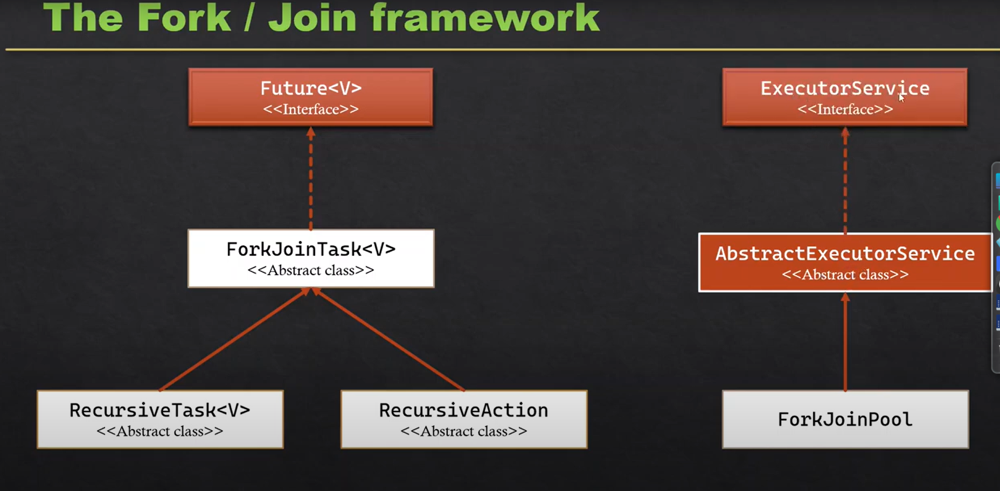

# Fork/Join Framework

## What is the Fork/Join Framework?

- The Fork/Join Framework (introduced in Java 7, java.util.concurrent) is used for parallel programming.
- It helps divide a large task into smaller subtasks (fork), execute them in parallel across multiple threads, and then combine results (join).
- It uses a work-stealing algorithm:
    - Idle threads “steal” tasks from busy threads’ queues → improves CPU utilization.

- It works on the Work Steal process where if any Thread gets free then it automatically picks the task from other Thread queue in a Thread Pool (which is Fork-join Pool).


## Key Components

1. **Fork**
- It breaks down the Task into smaller subtasks.

2. **Join**
- It waits for the result of subtasks, combine them and then produce the final result for the task.


## Main classes of Fork-Jon Framework

1. **ForkJoinPool**

- Special thread pool designed to execute Fork/Join tasks.
- Manages worker threads efficiently using work-stealing.
- It manages the execution of ForkJoinTasks.

2. **RecursiveTask<V>**

- Used when the task returns a result.
- It is an abstract class that represent a task that can be executed asynchronously in ForkJoinPool.

3. **RecursiveAction**

- Used when the task does not return a result.
- It is a subclass of ForkJonTask<V> that represents a task that does not returns a value.

4. **RecursiveTask<V>**

- Used when the task to return a result.
- It is a subclass of ForkJonTask<V> that represents a task that returns a value.




## Methods of Fork-Jon - 

### ForkJoinPool constructors - 

1. **ForkJoinPool()** → It creates a default pool that supports a level of parallelism equal to the number of processors available in the system to process the task concruently.

2. **ForkJoinPool(int parallelism)** → It creates a default pool that supports a level of parallelism equal to the arguments which we pass.

#### methods - 
1. **<T> T invoke(ForkJoinTask<T> task)** → Initiate a parallel execution of given task, wait for its completion and returns the result of task.
2. **void execute(ForkJoinTask<T> task)** → If you want to start a task without waiting for its completion. It execute the task asynchronously.
2. **static ForkJoinPool commonPool()** → It is used to run a task without setting up the pool of thread. Java takes care of it.


### ForkJoinTask<V>

1. **final ForkJoinTask<V> fork()** → This method tell a task to start executing asynchronously.
    - This method can be used when you have task that can be further divided into smaller subtasks that can execute concurrently.

2. **final V join()** → This method waits for result of subtasks.

3. **final V invoke()** → It does the work of fork and join all together, means it is a comination of fork and join.

4. **final V invokeAll(FortJoinTask<?> t1, FortJoinTask<?> t2)** → It can invoke multiple tasks at a time.

### RecursiveAction

1. **protected abstract void compute()** → 
    - This method defines actual work to be performed by the task.
    - It is were you write the code to be performed.
    - Protected and abstract represents that this method must be implemented by the subclass. 

    
### RecursiveTask<V>

1. **protected abstract V compute()** → 
    - This method defines actual work to be performed by the task.
    - It is were you write the code to be performed.
    - Protected and abstract represents that this method must be implemented by the subclass. 


### Example 1: Using RecursiveTask (Sum of Array)

```
import java.util.concurrent.*;

// Task: Sum part of an array
class SumTask extends RecursiveTask<Long> {
    private static final int THRESHOLD = 5;
    private int[] arr;
    private int start, end;

    SumTask(int[] arr, int start, int end) {
        this.arr = arr;
        this.start = start;
        this.end = end;
    }

    @Override
    protected Long compute() {
        // If small enough, compute directly
        if (end - start <= THRESHOLD) {
            long sum = 0;
            for (int i = start; i < end; i++) {
                sum += arr[i];
            }
            return sum;
        } else {
            // Split task into two subtasks
            int mid = (start + end) / 2;
            SumTask leftTask = new SumTask(arr, start, mid);
            SumTask rightTask = new SumTask(arr, mid, end);

            // Fork subtasks (run asynchronously)
            leftTask.fork();
            rightTask.fork();

            // Join results (wait for completion)
            return leftTask.join() + rightTask.join();
        }
    }
}

public class ForkJoinExample {
    public static void main(String[] args) {
        int[] numbers = new int[20];
        for (int i = 0; i < numbers.length; i++) {
            numbers[i] = i + 1; // fill with 1..20
        }

        ForkJoinPool pool = new ForkJoinPool();
        SumTask task = new SumTask(numbers, 0, numbers.length);

        long result = pool.invoke(task);
        System.out.println("Sum: " + result); // Should print 210
    }
}
```


### Example 2: Using RecursiveAction (No Return)

```
import java.util.concurrent.*;

class PrintTask extends RecursiveAction {
    private int start, end;

    PrintTask(int start, int end) {
        this.start = start;
        this.end = end;
    }

    @Override
    protected void compute() {
        if (end - start <= 3) {
            for (int i = start; i < end; i++) {
                System.out.println(Thread.currentThread().getName() + " prints " + i);
            }
        } else {
            int mid = (start + end) / 2;
            PrintTask left = new PrintTask(start, mid);
            PrintTask right = new PrintTask(mid, end);
            invokeAll(left, right); // fork both subtasks
        }
    }
}

public class ForkJoinActionExample {
    public static void main(String[] args) {
        ForkJoinPool pool = new ForkJoinPool();
        pool.invoke(new PrintTask(0, 10));
    }
}
```


## When to Use Fork/Join?

- CPU-intensive tasks (like math computations, array processing, image processing).
- Not ideal for I/O-bound tasks (network, file access).


### Advantages

- Efficient use of multi-core processors.
- Automatic load balancing (work-stealing).
- Fine-grained parallelism.


### Comparison with ThreadPool

| Feature        | ThreadPoolExecutor        | ForkJoinPool                        |
| -------------- | ------------------------- | ----------------------------------- |
| Task type      | Independent tasks         | Recursive, divide-and-conquer tasks |
| Load balancing | Round-robin / queue-based | Work-stealing                       |
| Best for       | Web requests, I/O tasks   | CPU-bound parallel tasks            |
