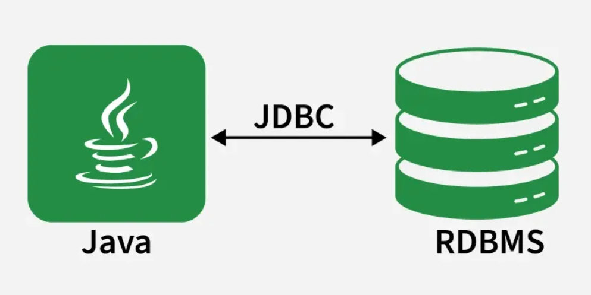
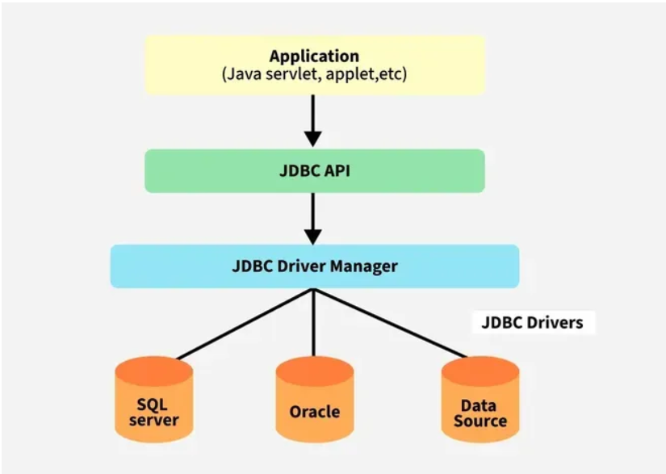
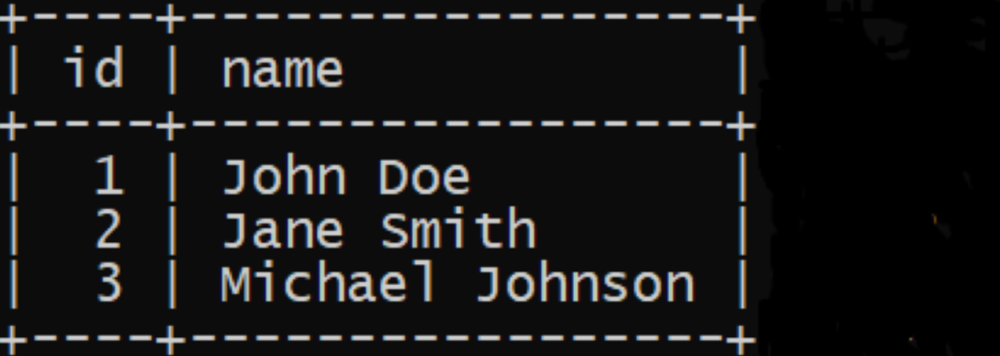

# JDBC

- JDBC (Java Database Connectivity) is a standard Java API that allows Java applications to connect to relational databases.

- It provides a set of interfaces and classes to send SQL queries, retrieve results and manage database connections.

- With JDBC, developers can build database-driven applications that are portable across various databases, including MySQL, PostgreSQL, Oracle and others.



### Features of JDBC

- **Platform Independent:** Write once, run anywhere (Java-based).
- **Database Independent:** Works with any relational database using drivers.
- **Standard API:** Provides a standard set of interfaces (Connection, Statement, ResultSet, etc.).
- **Secure:** Uses Java security model and exception handling.
- **Easy to Use:** Simplifies database connectivity with simple method calls.
- **Supports SQL:** Can execute SQL queries directly from Java code.


# 1. JDBC Architecture

JDBC Architecture defines how Java applications interact with databases through drivers using a standard API.



## JDBC architecture consists of two main layers

### 1.1. JDBC API (Application Layer)

- Provides Java applications with the interface to interact with databases.
- Contains classes and interfaces in the java.sql and javax.sql packages.
- Example interfaces: Connection, Statement, PreparedStatement, ResultSet.


### 1.2. JDBC Driver API (Driver Layer)

- Acts as a bridge between JDBC API calls and the actual database.
- Converts Java method calls into database-specific calls.


# 2. Real-world Example of JDBC

Suppose two places, A and B. People in A don’t know the language of people in B and vice versa. To communicate, they need a translator.

- Place A -> Java Application
- Place B -> Database
- Translator -> JDBC Driver (converts Java calls to DB calls and back)
- Road -> Connection (pathway between Java and DB)
- Vehicle -> Statement (carries SQL queries)
- Requirement -> SQL Query
- Small Block (Response) -> ResultSet (data returned from DB)

This entire communication system is what we call Java Database Connectivity (JDBC).


# 3. Types of JDBC Drivers

JDBC drivers act as a mediator between Java applications and databases.

- **Type-1 driver or JDBC-ODBC bridge driver (Bridge Driver):** Uses ODBC driver, now deprecated.
- **Type-2 driver or Native-API driver (Native API):** Converts JDBC calls into native DB API calls.
- **Type-3 driver or Network Protocol driver (Network Protocol):** Uses middleware server for database communication.
- **Type-4 driver or Thin driver (Native protocol):** Directly communicates with the database, most commonly used.


# 4. JDBC Classes and Interfaces

Some popular interfaces of JDBC API are listed below:

- **Driver interface:** Handles communication between Java application and the database.
- **Connection interface:** Represents a session/connection with a specific database.
- **Statement interface:** Used to execute simple SQL queries without parameters.
- **PreparedStatement interface:** Used to execute precompiled parameterized SQL queries.
- **CallableStatement interface:** Used to call stored procedures in the database.
- **ResultSet interface:** Represents the data retrieved from a SELECT query.
- **ResultSetMetaData interface:** Provides information about columns of a ResultSet.
- **DatabaseMetaData interface:** Provides information about the database (tables, drivers, etc.).
- **RowSet interface:** A scrollable and updatable version of ResultSet.

Some important Classes of JDBC API are listed below:

- **DriverManager class:** Manages and loads database drivers to establish connections.
- **Blob class:** Represents binary large objects (e.g., images, audio, video).
- **Clob class:** Represents character large objects (e.g., text files, large strings).
- **Types class:** Defines constants for SQL data types.


# 5. Establishing JDBC Connection


To perform database operations using JDBC, follow these standard steps:

1. **Import JDBC package:** Include java.sql classes for database operations.
2. **Load and register driver:** Load the JDBC driver class to enable communication using forname() method
3. **Establish connection:** Use DriverManager to connect to the database.
4. **Create statement:** Create Statement or PreparedStatement to send SQL queries.
5. **Execute query:** Run SQL commands like SELECT, INSERT, UPDATE or DELETE using
6. **Process results:** Retrieve and handle data from ResultSet.
7. **Close resources:** Release database connections and objects.

# 6. JDBC Example

### SQL Setup

Suppose we have a table students:

```
CREATE DATABASE school;
USE school;

CREATE TABLE students (
    id INT PRIMARY KEY,
    name VARCHAR(50),
    age INT
);

INSERT INTO students VALUES (1, 'Amit', 21), (2, 'Riya', 22);

```

### Java Code

```
import java.sql.*;

public class JDBCDemo {
    public static void main(String[] args) {
        String url = "jdbc:mysql://localhost:3306/school";
        String user = "root";
        String password = "your_password";

        try {
            // 1. Load Driver (Optional for newer JDBC versions)
            Class.forName("com.mysql.cj.jdbc.Driver");

            // 2. Establish Connection
            Connection con = DriverManager.getConnection(url, user, password);

            // 3. Create Statement
            Statement stmt = con.createStatement();

            // 4. Execute Query
            ResultSet rs = stmt.executeQuery("SELECT * FROM students");

            // 5. Process Results
            while (rs.next()) {
                System.out.println(rs.getInt("id") + " " + rs.getString("name") + " " + rs.getInt("age"));
            }

            // 6. Close resources
            rs.close();
            stmt.close();
            con.close();
        } catch (Exception e) {
            e.printStackTrace();
        }
    }
}
```


# 7. Crud Operation with JDBC

CRUD stands for Create, Read, Update, Delete, which are the four basic operations performed on a database using JDBC.

- **Create:** Used to insert new records into the database (INSERT query).
- **Read:** Used to fetch records from the database (SELECT query).
- **Update:** Used to modify existing records in the database (UPDATE query).
- **Delete:** Used to remove records from the database (DELETE query).


# 8. JDBC Exception Handling

When we communicate  with databases,some problems occur like:

- Invalid SQL syntax bad query
- Connection time out problem 
- Wrong data types mentioned
- miss  database drivers

To handle these issues gracefully, JDBC provides exception handling mechanisms

```
catch (SQLException e) {
    System.out.println("Error: " + e.getMessage());
    System.out.println("SQL State: " + e.getSQLState());
    System.out.println("Error Code: " + e.getErrorCode());
}
```


# 9. Transactions in JDBC
A transaction is a sequence of SQL operations that are executed as a single unit of work. Transactions help maintain data consistency and integrity in applications. By default, JDBC runs in auto-commit mode (each SQL statement is committed immediately). To manage transactions manually:

- **setAutoCommit(false):** disables auto-commit.
- **commit():** permanently saves changes.
- **rollback():** undoes changes since last commit.

Example - 

```con.setAutoCommit(false);

PreparedStatement ps1 = con.prepareStatement("UPDATE accounts SET balance=balance-100 WHERE id=1");
PreparedStatement ps2 = con.prepareStatement("UPDATE accounts SET balance=balance+100 WHERE id=2");

ps1.executeUpdate();
ps2.executeUpdate();

con.commit();  // commit if both succeed
con.rollback(); // rollback if error
```


# 10. How to Handle Connection Pooling in JDBC in Java

Efficient management of database connections is important for high-performance Java applications. Creating a new database connection for each request is expensive, involving:

- Costly network communication
- Authentication
- Resource allocation
To optimize this, we utilize connection pooling.


# 11. What is Connection Pooling

A technique to reuse existing database connections instead of creating new ones for each request. When an application needs to perform a database operation:

- It borrows a connection from the pool.
- Uses it for queries/updates.
- Returns it to the pool for reuse.


### Prerequisites

The Following are the Prerequisites to Handle Connection Pooling in JDBC in Java

- Database setup (e.g., MySQL)
- JDBC driver (Connector/J for MySQL)
- Connection Pooling Library (e.g., HikariCP)
- Java development environment (JDK + IDE like Eclipse/IntelliJ)
- Project configuration with dependencies


# 12. Steps to Handle Connection Pooling in JDBC

## Step 1: Create a Table in Your Database

Create a table in your database (Example: Employee).

Here is the basic example of an employee table:




## Step 2: Set Up Project in Eclipse IDE

- Open Eclipse IDE. Create one Java project and name it as JDBCWithHikariCP.
- Add HikariCP Dependency to the Java project.
- Create two Class files in a Java project and name it as ConnectionManager and Main respectively.


## Step 3: Implement the Code

```
import java.sql.Connection;
import java.sql.SQLException;
import com.zaxxer.hikari.HikariConfig;
import com.zaxxer.hikari.HikariDataSource;

public class ConnectionManager {
    private static final HikariDataSource dataSource;

    static {
        HikariConfig config = new HikariConfig();
        config.setJdbcUrl("jdbc:mysql://localhost:3307/work");
        config.setUsername("root");
        config.setPassword("tiger");
      
          // Set maximum pool size
        config.setMaximumPoolSize(10); 
        // Other configuration options

        dataSource = new HikariDataSource(config);
    }

    public static Connection getConnection() throws SQLException {
        return dataSource.getConnection();
    }

    public static void close() {
        if (dataSource != null) {
            dataSource.close();
        }
    }
}
```


#### Explanation of the above Program:
- Import the classes/interfaces for the JDBC and HikariCP configuration.
- Manage the database connection using the HikariCP connection pooling.
- Once the class is loaded into the memory, it will be execute.
- Configures HikariCP DataSource with the connection parameters such as JDBC URL, username, passwords and maximum pool size.
- Retrieves a database connection from connection pool with the help of getConnection() Method.
- If a connection can't be obtained, it will throws the SQLException.
- Closes the connection with close() method.
- To avoid the NullPointerException, checks if the dataSource is not null before closing.


## Step 4: Use ConnectionManager in Main Class

Open Main.java file and replace with the below code:

```
import java.sql.Connection;
import java.sql.PreparedStatement;
import java.sql.ResultSet;
import java.sql.SQLException;

public class Main {
    public static void main(String[] args) {
        Connection connection = null;
        PreparedStatement preparedStatement = null;
        ResultSet resultSet = null;

        try {
            // Get connection from ConnectionManager
            connection = ConnectionManager.getConnection();

            if (connection != null) {
                // Prepare statement
                String sql = "SELECT * FROM employees";
                preparedStatement = connection.prepareStatement(sql);

                // Execute query
                resultSet = preparedStatement.executeQuery();

                // Process and print results
                while (resultSet.next()) {
                    int id = resultSet.getInt("id");
                    String name = resultSet.getString("name");
                    System.out.println("ID: " + id + ", Name: " + name);
                }
            } else {
                System.out.println("Failed to get connection.");
            }
        } catch (SQLException e) {
            e.printStackTrace();
        } finally {
            // Close resources
            try {
                if (resultSet != null) resultSet.close();
                if (preparedStatement != null) preparedStatement.close();
                if (connection != null) connection.close(); // Return connection to pool
            } catch (SQLException e) {
                e.printStackTrace();
            }
        }

        // Close the connection pool when application exits
        ConnectionManager.close();
    }
}
```


### Explanation of the above Program:
- Program starts execution from the main method.
- Declares Connection, PreparedStatement, and ResultSet for database operations.
- Gets the database connection from ConnectionManager.
- Prepares and executes an SQL query to fetch employee data.
- Stores results in ResultSet and iterates to print employee details.
- Uses try-catch to handle SQLException.
- Closes all resources in the finally block to avoid leaks.
- Shuts down the connection pool after program completion.


## Step 5: Run the Code

1. After complete the implementation of code, you need to run the code.
2. For run the code, right click on the project the Run As > Java Application.