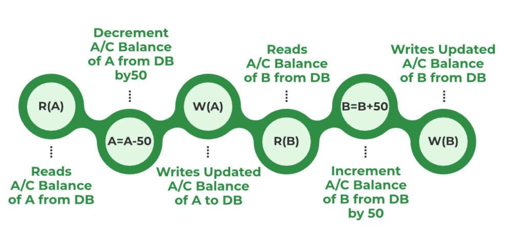
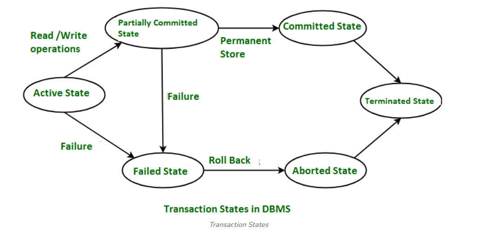

# Transaction Management

- Transactions are a set of operations used to perform a logical set of work. 
- A transaction usually means that the data in the database has changed.
- One of the major uses of DBMS is to protect the user data from system failures.
- It is done by ensuring that all the data is restored to a consistent state when the computer is restarted after a crash.
- The transaction is any one execution of the user program in a DBMS.
- One of the important properties of the transaction is that it contains a finite number of steps. Executing the same program multiple times will generate multiple transactions. 

Example: Consider the following example of transaction operations to be performed to withdraw cash from an ATM vestibule.

Steps for ATM Transaction 
1. Transaction Start.
2. Insert your ATM card.
3. Select a language for your transaction.
4. Select the Savings Account option.
5. Enter the amount you want to withdraw.
6. Enter your secret pin.
7. Wait for some time for processing.
8. Collect your Cash.
9. Transaction Completed.


**A transaction can include the following basic database access operation.**

- **Read/Access data (R):** Accessing the database item from disk (where the database stored data) to memory variable.

- **Write/Change data (W):** Write the data item from the memory variable to the disk.

- **Commit:** Commit is a transaction control language that is used to permanently save the changes done in a transaction.

Example: Transfer of 50₹ from Account A to Account B. Initially A= 500₹, B= 800₹. This data is brought to RAM from Hard Disk. 

```
R(A) -- 500       // Accessed from RAM.
A = A-50          // Deducting 50₹ from A.
W(A)--450         // Updated in RAM.
R(B) -- 800       // Accessed from RAM.
B=B+50            // 50₹ is added to B's Account.
W(B) --850        // Updated in RAM.
commit            // The data in RAM is taken back to Hard Disk.
```




All instructions before committing come under a partially committed state and are stored in RAM. When the commit is read the data is fully accepted and is stored on a Hard Disk. 

If the transaction is failed anywhere before committing we have to go back and start from the beginning. We can't continue from the same state. This is known as **Roll Back**. 


## Desirable Properties of Transaction (ACID Properties)

- Transaction management in a Database Management System (DBMS) ensures that database transactions are executed reliably and follow ACID properties: **Atomicity, Consistency, Isolation, and Durability**.

- These principles help maintain data integrity, even during failures or concurrent user interactions, ensuring that all transactions are either fully completed or rolled back if errors occur.

- For a transaction to be performed in DBMS, it must possess several properties often called ACID properties.

    - **A** - Atomicity
    - **C** - Consistency
    - **I** - Isolation
    - **D** - Durability

## Transaction States
Transactions can be implemented using SQL queries and Servers. In the diagram, you can see how transaction states work. 



The transaction has four properties. These are used to maintain consistency in a database, before and after the transaction.
Property of Transaction:

- Atomicity
- Consistency
- Isolation
- Durability


### Atomicity
- States that all operations of the transaction take place at once if not, the transactions are aborted.
- There is no midway, i.e., the transaction cannot occur partially. Each transaction is treated as one unit and either run to completion or is not executed at all.
- Atomicity involves the following two operations:
- **Abort:** If a transaction stops or fails, none of the changes it made will be saved or visible.
- **Commit:** If a transaction completes successfully, all the changes it made will be saved and visible.


### Consistency
- The rules (integrity constraint) that keep the database accurate and consistent are followed before and after a transaction.
- When a transaction is completed, it leaves the database either as it was before or in a new stable state.
- This property means every transaction works with a reliable and consistent version of the database.
- The transaction is used to transform the database from one consistent state to another consistent state. A transaction changes the database from one consistent state to another consistent state.


### Isolation
- It shows that the data which is used at the time of execution of a transaction cannot be used by the second transaction until the first one is completed.
- In isolation, if the transaction T1 is being executed and using the data item X, then that data item can't be accessed by any other transaction T2 until the transaction T1ends.
- The concurrency control subsystem of the DBMS enforced the isolation property.


### Durability
- The durability property is used to indicate the performance of the database's consistent state. It states that the transaction made the permanent changes.
- They cannot be lost by the erroneous operation of a faulty transaction or by the system failure. When a transaction is completed, then the database reaches a state known as the consistent state. That consistent state cannot be lost, even in the event of a system's failure.
- The recovery subsystem of the DBMS has the responsibility of Durability property.


## Implementing of Atomicity and Durability

The recovery-management component of a database system can support atomicity and durability by a variety of schemes. E.g. the shadow-database scheme:

### Shadow copy
- In the shadow-copy scheme, a transaction that wants to update the database first creates a complete copy of the database.
- All updates are done on the new database copy, leaving the original copy, the shadow copy, untouched. If at any point the transaction has to be aborted, the system merely deletes the new copy. The old copy of the database has not been affected.
- This scheme is based on making copies of the database, called shadow copies, assumes that only one transaction is active at a time.
- The scheme also assumes that the database is simply a file on disk. A pointer called db pointer is maintained on disk, It points to the current copy of the database.


## Transaction Isolation Levels in DBMS

Some other transaction may also have used value produced by the failed transaction. So we also have to rollback those transactions. The SQL standard defines four isolation levels:

- **Read Uncommitted:** Read Uncommitted is the lowest isolation level. In this level, one transaction may read not yet committed changes made by other transaction, there by allowing dirty reads. In this level, transactions are not isolated from each other.

- **Read Committed:** This isolation level guarantees that any data read is committed at the moment it is read. Thus it does not allows dirty read. The transaction holds a read or write lock on the current row, and thus prevent other transactions from reading, updating or deleting it.

- **Repeatable Read:** This is the most restrictive isolation level. The transaction holds locks on all rows it references and writes locks on all rows it inserts, updates, deletes. Since other transaction cannot read, update or delete these rows, consequently it
avoids non-repeatable read.

- **Serializable:** This is the Highest isolation level. A serializable execution is guaranteed to be serializable. Serializable execution is defined to be an execution of operations in which concurrently executing transactions appears to be serially executing.


## Failure Classification
To find that where the problem has occurred, we generalize a failure into the following categories:

- Transaction failure
- System crash
- Disk failure