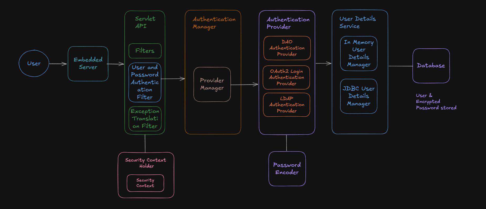
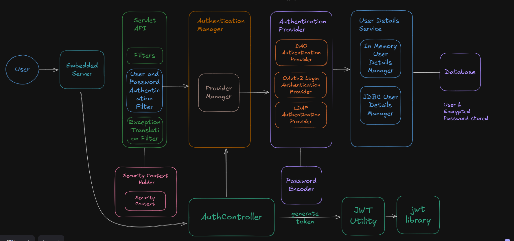

# Spring Security


Topics - 

1. What is Spring Security
    - Authentication
    - Authorization
2. Dependency for Spring Security
3. Spring Security Basic Auth
4. Spring Security JWT Auth


## 1. What is Spring Security 

- It is a feature of Spring Boot which helps to protect APIs, web apps and microsevices from unauthorized access, attacks and security threats.

###  1.1 What is Authentication 

- It is a process to identify who you are.
- It ensures that the user is legitimate before granting access.


### 1.2 What is Authorization

- Authorization determines what you can do after authentications.
- It ensures user only access what they are allowed to.


### 1.3 Architecture of Spring Boot Security



**User and Password Authentication Fitler** - It is a filter proided by Spring Boot in Servlet API which helps to implement Security features.

**ExceptionTranlationFilter**- IT helps to manage or redirect the request when Authenticaiton Fails.

**AuthenticationManager** - It helps to choose which Authentication technique you wants to use through its providerManager.

**AuthenticationProvider** - It provides the implementation of different ways to Authentications like DAOAuthentication, OAuth2LoginAuthenticationProvider and LDAPAuthenticationProvider.

- The word DAO stands for Data Access Object, meaning it retrieves user details from a data source (like a database).

- DAOAuthentication uses a UserDetailsService and a PasswordEncoder to perform authentication. 

**User Details Service** - It is a service provided by Spring Boot to access the User and its Encoded Password from memory or database.

**Security Context Holder** - It helps to hold the User Authentication details which can be used by other Spring Application Layers. It also helps to maintain the details on Authenticated User on the session.


## 2. Dependency for Spring Boot Security 

```
<!-- Dependency for Spring Boot Security -->
<dependency>
    <groupId>org.springframework.boot</groupId>
    <artifactId>spring-boot-starter-security</artifactId>
</dependency>
```

If you use this Dependecy, it automatically enables Form Based Authentication for Development purpose where User Name is user and password will be available on IDE Console.


## 3. Spring Security Basic Auth

### 3.1 Configuration for Spring Security Basic Auth

- You can explicitely define a Filter Chain by creating a configuration class (lets say SecurityConfig) in a separate package (lets say config package) like below code - 

```
@Configuration
@EnableWebSecurity
public class SecurityConfig {

    @Bean
    public SecurityFilterChain filterChain (HttpSecurity http) throws Exception {

        http.authorizeHttpRequests( auth -> auth.anyRequest().authenticated() ).httpBasic( withDefaults() );
        return http.build();
        
    }
    
}
```

- Define User and password on `application.properties` file like below - 

```
spring.security.user.name = admin
spring.security.user.password = admin1234
```

> ⚠️ **Note** - This above configuration will use the User and password maintained on the application.properties file.

### 3.2 Store the User Details on Database (in memory db)

#### Steps to follow - 
1. Create an Entity which will store the User detials
2. Create a Repository to deal with Entity
3. Create implementation of UserDetailsService (Spring Provided) as it interacts with DB.
4. Create Custom Security Configuration

#### Step 1 - Create an Entity which will store the User details like below - 

It needs to implement the Spring provided UserDetails Interface because the spring provided UserDetailsService expect the UserDetails.

```
import jakarta.persistence.Entity ;

@Entity
public class Users implements UserDetails {
    @Id
    @GeneratedValue(strategy = GenerationType.IDENTITY)
    private Long id ;
    private String username ;
    private String password ;
    private String role ;


    .... getter and setters
}
```

#### Step 2 - Create a Repository for the same - 

```
@Repository
public interface UserDetailsRepository extends JpaRepository<Users, Long>{
    Optional<Users> findByUsername (String username);
}
```


#### Step 3 - Create implementation of UserDetailsService (Spring Provided) as it interacts with DB.

1. Create Custom Service class which will implement the Spring provided UserDetailsService Interface

```
@Service
public class CustomUserDetailsService implements UserDetailsService {

    @Autowired
    private UserDetailsRepository userDetailsRepository ;   //  The repository which we created above.
    
    @Override
    public UserDetails loadUserByUserName (String username) throws UsernameNotFoundException {

        userDetailsRepository.findByUserName(username).orElseThrow(()-> new UsernameNotFoundException("Username not found") );
        
    }

}
```

#### Step 4 - Create custom Security Configuration to define custom filter chain and Authentication Manager

1. Define custom filter chain (which will decide if all endpoints need to be authenticated)
2. Define Basic Auth in custom filter chain.
3. Define the Bean of Custom User Details service created.
4. Define the Bean of type of Password Encoder wants to use. 
5. Define the Bean of Authentication Manager which will return Authentication Manager with details of User Details Service and Password Encoder with the help of DAO Authentication Provider

    5.1. Create a new object of DAOAuthenticationProvider

    5.2. Now provide our custom defined Service to DAO

    5.3. Set type of password Encoder to DAO Authentication 

    5.4. Provider the DAO Authentication to Authentication Manager    

In `Config` package, create the below class -

```
@Configuration
@EnableWebSecurity
public class SecurityConfig {

    //  1. Define custom filter chain (which will decide if all endpoints need to be authenticated)

    @Bean
    public SecurityFilterChain filterChain (HttpSecurity http) throws Exception {

        //  2. Define Basic Auth in custom filter chain - 

        http.authorizeHttpRequests( auth -> auth.anyRequest().authenticated() ).httpBasic( withDefaults() );
        return http.build();
        
    }


    //  3. Define the Bean of Custom User Details service created.

    @Bean
    public UserDetailsService userDetailsService() {
        return new CustomUserDetailsService() ;     // Custom Service which we created
    }


    //  4. Define the Bean of type of Password Encoder wants to use.

    @Bean
    public PasswordEncoder passwordEncoder () {
        return new BCryptPasswordEncoder() ;
    }

    //  5. Define the Bean of Authentication Manager which will return Authentication Manager with details of User Details Service and Password Encoder with the help of DAO Authentication Provider
    
    @Bean
    public AuthenticationManager authenticationManager(UserDetailsService userDetailsService, PasswordEncoder passwordEncoder){

        //  5.1. Create a new object of DAOAuthenticationProvider
        DaoAuthenticationProvider daoAuthenticationProvier = new DaoAuthenticationProvider() ;

        //  5.2. Now provide our custom defined Service to DAO Authentication
        daoAuthenticationProvider.setUserDetailsService(userDetailsService) ;
        
        // 5.3. Set type of password Encoder to DAO Authentication 
        daoAuthenticationProvider.setPasswordEncoder(passwordEncoder);

        //  5.4. Provider the DAO Authentication to Authentication Manager
        return new AuthenticationManager(daoAuthenticationProvider);
    }
    
}
```


> **⚠️ Note -** If you wants to permit few endpoint not to get authentication, then define it like below - 


```
@Configuration
@EnableWebSecurity
public class SecurityConfig {

    //  1. Define custom filter chain (which will decide if all endpoints need to be authenticated)

    @Bean
    public SecurityFilterChain filterChain (HttpSecurity http) throws Exception {

        //  2. Define Basic Auth in custom filter chain - 

       http.csrf(AbstractHttpConfigurer::disable)
        .authorizeHttpRequests( auth -> auth.requestMatchers("/endpoint").permitAll()
        .anyRequest().authenticated())
        .httpBasic(withDefaults()) ;
        
        return http.build();
    }


    //  3. Define the Bean of Custom User Details service created.

    @Bean
    public UserDetailsService userDetailsService() {
        return new CustomUserDetailsService() ;     // Custom Service which we created
    }


    //  4. Define the Bean of type of Password Encoder wants to use.

    @Bean
    public PasswordEncoder passwordEncoder () {
        return new BCryptPasswordEncoder() ;
    }

    //  5. Define the Bean of Authentication Manager which will return Authentication Manager with details of User Details Service and Password Encoder with the help of DAO Authentication Provider
    
    @Bean
    public AuthenticationManager authenticationManager(UserDetailsService userDetailsService, PasswordEncoder passwordEncoder){

        //  5.1. Create a new object of DAOAuthenticationProvider
        DaoAuthenticationProvider daoAuthenticationProvier = new DaoAuthenticationProvider() ;

        //  5.2. Now provide our custom defined Service to DAO Authentication
        daoAuthenticationProvider.setUserDetailsService(userDetailsService) ;
        
        // 5.3. Set type of password Encoder to DAO Authentication 
        daoAuthenticationProvider.setPasswordEncoder(passwordEncoder);

        //  5.4. Provider the DAO Authentication to Authentication Manager
        return new AuthenticationManager(daoAuthenticationProvider);
    }
    
}
```


## 4. Spring Security JWT Auth



### Why need JWT ?

- In the Basic Auth, whenever the request is reaching to server, it needs to be authenticated and the client needs to send user and password everytime.
- Handling Roles and permission is difficult with Basic Auth.

### Steps to follow - 

1. Add JWT Dependencies.
2. Create a JWT Utility class which will help to create, validate and extract info from Token
3. Create a AuthRequest DTO class which will store the Request Body data.
4. Define the Method endpoint in Rest Controller.
5. Create your own Custom Filter Class for JWT to authenticate the token and store it on SecurityContextHolder
6. Add your Custom Filter in SecurityConfig file to execute your filter before UsernamePasswordAuthenticationFilter.


#### 1. Add JWT Dependencies in pom.xml file - 

```
<dependency>
    <groupId>io.jsonwebtoken</groupId>
    <artifactId>jjwt-api</artifactId>
    <version>0.11.5</version>
</dependency>

<dependency>
    <groupId>io.jsonwebtoken</groupId>
    <artifactId>jjwt-impl</artifactId>
    <version>0.11.5</version>
    <scope>runtime</scope>
</dependency>

<dependency>
    <groupId>io.jsonwebtoken</groupId>
    <artifactId>jjwt-jackson</artifactId>
    <version>0.11.5</version>
    <scope>runtime</scope>
</dependency>
```

#### 2. Create a JWT Utility class which will help to create, validate and extract info from Token

In `Utility` package create the below class - 

```
import io.jsonwebtoken.Jwts ;
import javax.crypto.SecretKey ;

@Component
public class JWTUtil {

    //  JWT Token Expiration Time
    private final long EXPIRATION_TIME = 1000 * 60 * 60 ; // 1 hour 

    //  Signature Key for the JWT Token
    private final String SECRET = "somethingsdfasdfasfpsfasdf" ;
    private final SecretKey key = Keys.hmacShaKeyFor(SECRET.getBytes());
    
    
    //  Method to Generate JWT Token 

    public String generateToken(String username) {

        return Jwts.builder()
                    .setSubject(username)
                    .setIssuedAt(new Date())
                    .setExpiration(new Date(System.currentTimeMillis() + EXPIRATION_TIME))
                    .signWith(key, SignatureAlgorithm.HS256)
                    .compact() ;
    }


    //  Method to Extract details from Token 

    public String extractUsernameFromToken(String token){

        Claims body = Jwts.parseBuilder()
                        .setSigningKey(key)
                        .build()
                        .parseClaimsJws(token)
                        .getBody();

        return body.getSubject();    
        
    }


    //  private boolean isTokenExpired(String token){
        Claims body = Jwts.parseBuilder()
                        .setSigningKey(key)
                        .build()
                        .parseClaimsJwt(token)
                        .getBody();

        return body.getExpiration().before(new Date());
        
    };


    //  Method to validate Token

    public boolean validateToken(String username, UserDetails userDetails, String token){

        //  Check user name is same as in Userdetails

        return username.equals(userDetails.getUsername()) && !isTokenExpired(token) ;

    }
    
}
```

#### 3. Create a AuthRequest DTO class which will store the Request Body data.

Create a Data Transfer Object AuthRequest which contains parameter like UserName and Password and will be used to store the Request body content in Controller - 

```
public class AuthRequest {
    private String userName ;
    private String password ;

    ... getters and setters ...
}
```

4. Define the Method endpoint in Rest Controller

Create the API endpoints in Controller (like AuthController here) - 
- define the endpoint which User will use to login
- To Authenticate the User, inject the AuthenticationManager which we created on SecurityConfig class
- Generate the JWT Token and return it

```
@RestController
public class AuthController {

    //  Inject the Authentication Manager creted on securityConfig class
    @Autowired
    public AuthenticationManager authenticationManager ;

    //  Injected our own created JWTUtil
    @Autowired
    JWTUtil jwtUtil ;

    @PostMapping("/authenticate")
    public String generateToken(@RequestBody AuthRequest authRequest){

        try{
            authenticationManager.authenticate(
            new UsernamePasswordAuthenticationToken(authRequest.getUsername(), authRequest.getPassword()) );

            //  Now generate JWT Token as the User is authenticated above
            String jwtToken = jwtUtil.generateToken(authRequest.username());

            return jwtToken ;
        }
        catch(Exception e){
            throw e ;
        }
    }
    
}
```


#### 5. Create your own Custom Filter Class for JWT to authenticate the token and store it on SecurityContextHolder.

Create Custom JWT Filter - 

- authenticate the token by extracting the detials from it.
- store the token in SecurityContextHolder

```
@Component
public class JwtAuthFilter extends OncePerRequestFilter {

    @Autowired
    JwtUtil jwtUtil ;

    @Autowired
    CustomUserDetailsService customUserDetailsService ;

    @Override void doFilterInternal(HttpServletRequest request, HttpServletResponse response, FilterChain filterChain) throws Exception {

        //  Extract the Token from Request Header
        
        String authHeader = request.getHeader("Authorization");

        String token = null ;
        String username = null ;

        if( authHeader != null && authHeader.startsWith("Bearer ") ){
            
            token = authHeader.subString(7) ;   //  getting details token after Bearer

            username = jwtUtil.extractUsernameFromToken(token);

        }

        //  Check and validate token contents

        if(username != null && SecurityContextHolder.getContext().getAuthentication() == null ){
            
            UserDetails userDetails = customUserDetailsService.loadUserByUsername(username) ;

            boolean isValid jwt.validateToken(username, userDetails, token);

            if(isValid){

                //  Set the token in Security Context

                UsernamePasswordAuthenticationToken uspToken = new UsernamePasswordAuthenticationToken(userDetails, null, userDetails.getAuthorities() );

                uspToken.setDetails(new WebAuthenticationDetailsSource().buildDetails(request));

                SecurityContextHolder.getContext().setAuthentication(uspToken);  
            }
        }

        filterChain.doFilter(request, response) ;
        
    }

}
```

#### 6. Add your Custom Filter in SecurityConfig file to execute your filter before UsernamePasswordAuthenticationFilter.

- remove the authentication from `/authentication` endpoint so that it can directly go to Auth Controller.
- Also, remove the Basic Authentication and add your Custom Filter.
- Hence, Go to `Config` package and in `SecurityConfig` class add the endpoint to skip authentication.


```
@Configuration
@EnableWebSecurity
public class SecurityConfig {

    @Autowired
    JwtAuthFilter jwtAuthFilter ;       //  your custom filter  

    //  1. Define custom filter chain (which will decide if all endpoints need to be authenticated)

    @Bean
    public SecurityFilterChain filterChain (HttpSecurity http) throws Exception {

        //  2. whitelist the /authenticate endpoint - 

       http.csrf(AbstractHttpConfigurer::disable)
        .authorizeHttpRequests( auth -> auth.requestMatchers("/authenticate").permitAll()
        .anyRequest().authenticated()) ;

        //  Add your custom filter before UsernamePasswordAuthentication Filter
        http.addFilterBefore(jwtAuthFilter, UsernamePasswordAuthenticationFilter.class);
        
        return http.build();
    }


    //  3. Define the Bean of Custom User Details service created.

    @Bean
    public UserDetailsService userDetailsService() {
        return new CustomUserDetailsService() ;     // Custom Service which we created
    }


    //  4. Define the Bean of type of Password Encoder wants to use.

    @Bean
    public PasswordEncoder passwordEncoder () {
        return new BCryptPasswordEncoder() ;
    }

    //  5. Define the Bean of Authentication Manager which will return Authentication Manager with details of User Details Service and Password Encoder with the help of DAO Authentication Provider
    
    @Bean
    public AuthenticationManager authenticationManager(UserDetailsService userDetailsService, PasswordEncoder passwordEncoder){

        //  5.1. Create a new object of DAOAuthenticationProvider
        DaoAuthenticationProvider daoAuthenticationProvier = new DaoAuthenticationProvider() ;

        //  5.2. Now provide our custom defined Service to DAO Authentication
        daoAuthenticationProvider.setUserDetailsService(userDetailsService) ;
        
        // 5.3. Set type of password Encoder to DAO Authentication 
        daoAuthenticationProvider.setPasswordEncoder(passwordEncoder);

        //  5.4. Provider the DAO Authentication to Authentication Manager
        return new AuthenticationManager(daoAuthenticationProvider);
    }
    
}
```