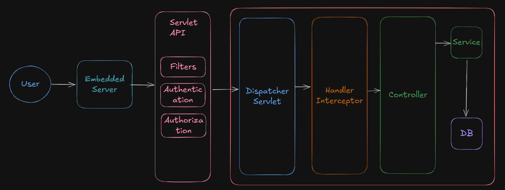

# Spring Interceptors

Topics - 
1. What are Interceptors ?
2. What is Handler Interceptor ?
3. How to use Interceptor ?
4. Interceptor VS Filter ?


## 1. What are Interceptors ?

In Spring Boot, Interceptors are like “middleware” that sit between the client request and the controller. They allow you to intercept HTTP requests/responses and perform logic before or after the controller processes the request.


## 2. What is Handler Interceptor ?

- It is a per-defined Interface which provides methods like **preHandle , postHandle , afterCompletion** which we can implement as per our requirement.

- The provided methods will execute before, after and after completion of Controller Execution.




## 3. How to use Interceptor ?

- You can create a Package for it (lets say Interceptor) inside which we can define a class (lets say LoggingInterceptor) which will implements the **HandlerInterceptor**.

- **HandlerInterceptor** is an Interface provided by Spring boot which have some predefined methods like preHandle , postHandle and afterCompletion and it works as its name suggest.

- But first, we need to register our Interceptor using **WebMvcConfigurer**, which we can do by creation a configuration class like below -  

```
@Configuration
public class WebConfig implements WebMvcConfigurer {

    @Autowired
    LoggingInterceptor loggingInterceptor ;

    @Override
    public void addinterceptors ( InterceptorRegister registery ) {
        
        registery.addInterceptor ( loggingInterceptor ).addPathPatterns("/api/**")
        .excludePathPatterns("/api/auth/**") ;

    }
    
}
```

And to consume it - 

```
@Component
public class LoggingInterceptor extends HandlerInterceptor {

    @Override
    public boolean perHandler ( HttpServletRequest request, HttpServletResponse response , Object handler ) {
        
        System.out.println( request.getRequestURI() );

        ..... we can perform any changes or modify the request before sending the request to Controller OR returning response to the user.......

    }


    @Override
    public void postHandler ( HttpServletRequest request, HttpServletResponse response , Object handler ) {
        
        System.out.println( request.getRequestURI() );

        ..... we can perform any changes or modify the request before sending the request to Controller OR returning response to the user.......
       
    }

    @Override
    public void afterCompletion ( HttpServletRequest request, HttpServletResponse response , Object handler ) {
        
        System.out.println( request.getRequestURI() );

        ..... we can perform any changes or modify the request before sending the request to Controller OR returning response to the user.......
       
    }
    
}
```


## 4. Interceptor VS Filter ?

- Interceptor is a part of Spring API (a feature from Spring).

- Filter is not the part of Spring API rather it comes into picture even before Spring Controller.

- So, we consider Filter comes unter Servlet API even before request reaches to Spring Application.