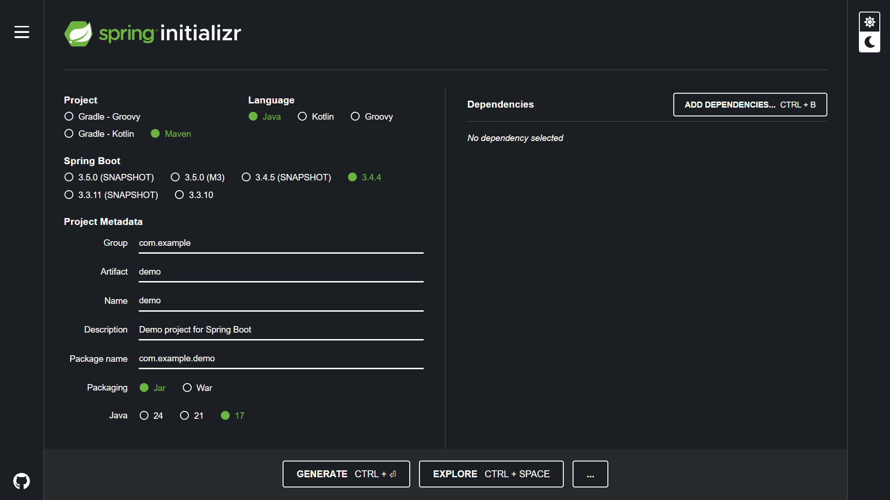

# What is Springboot ?
Spring Boot is a framework built on top of the Spring Framework that makes it super easy to create standalone, production-grade Java applications.

- **Spring -** Powerful but requires lots of configuration

- **Spring Boot -** Spring + Auto Configuration + Built-in Server = Quick Setup & Fast Development


## Why Use Spring Boot..?
1. No Boilerplate Setup is needed to manually configure things like: Tomcat server, Data sources, Dependencies.
2. It comes with built-in Tomcat, so you don’t need to deploy WAR files to external servers.
3. **Convention Over Configuration -** Spring Boot follows “sensible defaults,” so you don’t need to configure everything unless you want to override something.
4.  **Production-Ready Features -** It provides Out of the box features like : Health checks, Metrics, Externalized configuration, Logging, Security (via Spring Security)

## What Can You Build With Spring Boot..?
We can build following services using Spring Boot-
1. REST APIs
2. Microservices
3. Full-stack web apps (with Thymeleaf, React, Angular, etc. for UI)
4. Backend systems
5. Batch jobs
6. Enterprise applications

## How to create the First Spring Boot Application..?
We can use the [spring boot initializr](https://start.spring.io/) page on the browser to create the spring boot application.

Here's what the configuration could look like.



Click on **Generate** button and it will get downloaded on your pc.


#### What is Maven ..?
Maven is a **build automation and dependency management tool for Java projects**.

It is like a project manager which help to:

1. Build your project (compile, test, package, etc.)
2. Download and manage libraries (aka dependencies)
3. Define your project structure and configuration in one file: pom.xml

##### Why Use Maven..?
1. **Manages Dependencies -** No need to download JAR files manually. Just add them in pom.xml, and Maven fetches them for you from a central repository.
2. **Standard Directory Layout -** Maven expects below kind of project structure.
```
project/
├── src/
│   └── main/
│       └── java/
│       └── resources/
├── pom.xml
```

3. **Automates the Build Lifecycle -**
With simple commands like:
```
mvn clean install
```
We can ask Maven to Clean previous builds, Compile your code, Run your tests and Package it (e.g., into a .jar or .war)

#### What is pom.xml?
POM is the Project Object Model which is an XML file where we configure:
1. Project info (name, version)
2. Dependencies
3. Build plugins
4. Repositories

